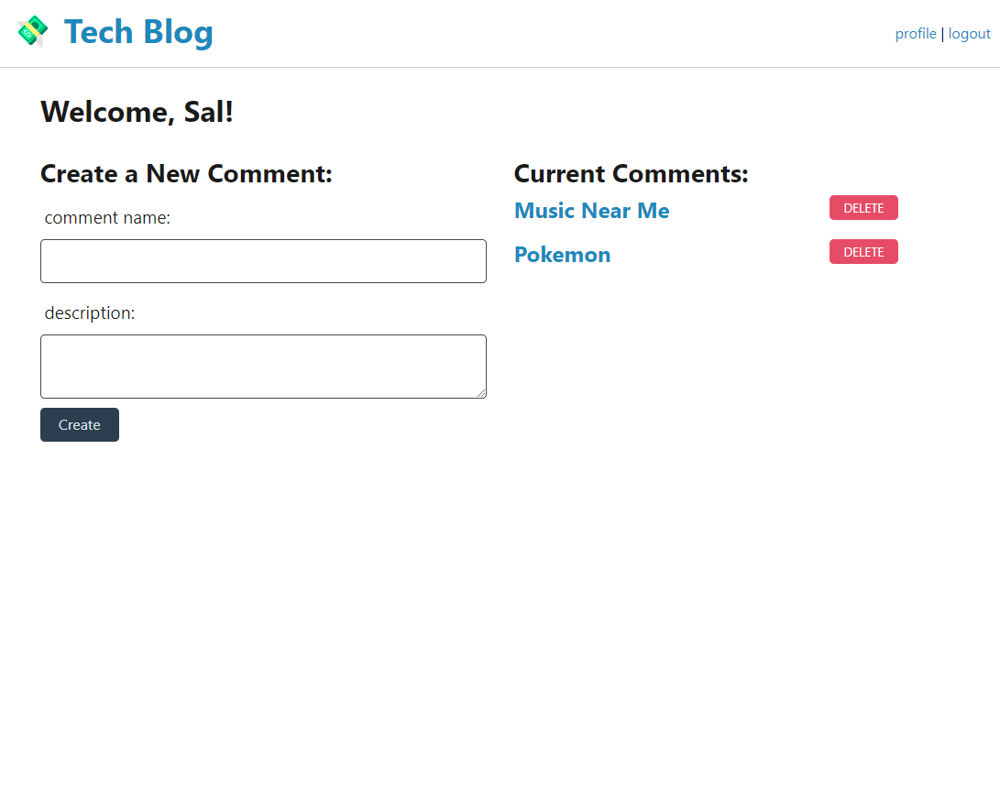

# UCSD_HW14_Tech-Blog
This program is to build a CMS-style blog site similar to a Wordpress site, where developers can publish their blog posts and comment on other developers’ posts as well.

## User History

```
AS A developer who writes about tech
I WANT a CMS-style blog site
SO THAT I can publish articles, blog posts, and my thoughts and opinions
```

## Related Links
* The Github Repository link: [My Github](https://github.com/hengyu89/UCSD_HW14_Tech-Blog)

* The program showed as Heroku: [Demo by Heroku](https://hw-tech-blog14.herokuapp.com/)

## Usage

* JavaScript
* Node.js
* Express
* session
* MySQL
* sequelize
* Heroku

## What I've done

* This program serve a blog site which users are able to create account, login their accounts.

* After logged in, they are able to see the history blogs they are posted. And abilities to create new on or delete old records.

* Once the user jumps back to the main page, they could see all posted blogs from all users.

## Screenshot:



